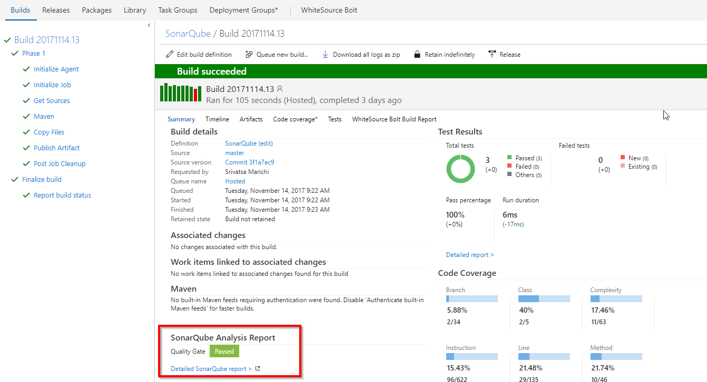

## Managing Technical Debt using VSTS and SonarQube 

## Overview

In this lab, you will be introduced to Technical Debt by configuring team build definitions to use SonarQube and  analyze the results.

<a href="https://www.sonarqube.org/">SonarQube</a> is an open source platform for continuous inspection of code quality to perform automatic reviews with static analysis of code to

- <a href="http://bit.ly/2AN9LIE">Detect Bugs
- Code Smells
- Security Vulnerabilities
- Centralize Quality</a>

## Pre-requisites

1. **Microsoft Azure Account:** You need a valid and active azure account for the labs

2. You need a **Visual Studio Team Services Account** and <a href="http://bit.ly/2gBL4r4">Personal Access Token</a>

3. You need a **SonarQube** server

## Setting up the project

1. Use <a href="https://vstsdemogenerator.azurewebsites.net" target="_blank">VSTS Demo Data Generator</a> to provision a project on your VSTS account.

   

2. Select **SonarQube** for the template.

3. Once the project is provisioned, select the URL to navigate to the project that you provisioned.

## Setting up the Environment

1. Click **Deploy To Azure** to provision SonarQube Server on Azure VM.

   

   Provide the following parameters as shown.

   <table width="100%">
   <thead>
      <tr>
         <th width="50%"><b>Parameter Name</b></th>
         <th><b>Description</b></th>
         
      </tr>
   </thead>
   <tr>
      <td>SQ_VM_Name</td>
      <td>name of the VM where SonarQube will be installed</td>
      
   </tr>
   <tr>
      <td>SQ_DNS_NAME</td>
      <td><b>unique</b> dns name to be provided with the following pattern:- <b>^[a-z][a-z0-9-]{1,61}[a-z0-9]$</b> or it will throw an error. For ex: sonarqubedns</td>
      
   </tr>
   <tr>
      <td>SQ_VM_UserName</td>
      <td>local admin account for the SonarQube VM</td>
      
   </tr>
   <tr>
      <td>SQ_VM_UserPassword</td>
      <td>password for the SonarQube VM</td>
      
   </tr>
   <tr>
      <td>SQ_DBAdmin_UserName</td>
      <td>admin account for Azure SQL Server</td>
      
   </tr>
   <tr>
      <td>SQ_DBAdmin_Password</td>
      <td>password for Azure SQL Server</td>
      
   </tr>
   
   </table>

2. Once the deployment is successful, you will see the resources in Azure Portal.

   

3. Access the **SonarQube** portal by browsing the public address. Copy the DNS name from the VM in Azure Portal as shown and append :9000 at the end. The final URL will be http://YOUR_DNS_NAME:**9000**

   

4. Login to the SonarQube Portal using the following credentials-    
   >**Username= admin, Password= admin**

   

## Exercise 1: Configure SonarQube Server

To start code analysis, we need a project to be created in the sonarqube. 

1. Login to the sonarqube portal.

2. Click **Administration**, go to **Projects-->Management**.

   

3. Create project with the details as shown.

   

## Exercise 2: Update Endpoint

During the project provisioning, a dummy endpoint would be created. We will update the endpoint with sonarqube details.

1. In VSTS, go to **Services** by clicking the gear icon, and click **Update service configuration** link .

   

2. Update endpoint with the below details and click **OK**-

   - **Server URL**: http://YOUR_DNS_NAME:9000
   - **User name**: admin
   - **Password**:  admin

   

## Exercise 3: Configure and Trigger build

Now that SonarQube server is running, we will trigger the build to analyse the java code provisioned by the demo generator system.

1. Go to **Builds** under **Build and Release** tab, Edit the build definition **SonarQube**. The tasks used in the build definition are listed.

   <table width="100%">
   <thead>
      <tr>
         <th width="50%"><b>Tasks</b></th>
         <th><b>Usage</b></th>
      </tr>
   </thead>
   <tr>
      <td><a href="http://bit.ly/2lvftfo"><b>Maven</b></a> </td>
      <td>builds and tests java code</td>
   </tr>
   <tr>
      <td><a href="http://bit.ly/2grMxTQ"><b>Copy Files</b></a>  </td>
      <td>copy files from source to destination folder using match patterns</td>
   </tr>
   <tr>
      <td><a href="http://bit.ly/2yBgXde"><b>Publish Build Artifacts</b></a>  </td>
      <td> publishes the build artifacts </td>
   </tr>
   </table>

3. Configure the **Maven** task with **Project Name, Project Key** as defined in **Exercise 1a-->step 3**.
   
    

   

3. Save and trigger the build.

   

4. You will see the build summary with **Test Results, Code Coverage** and link to **SonarQube Analysis Report** when completed.

   

5. Go to **SonarQube** portal by clicking on the link in the build summary to see the dashboard.

   

## Exercise 4: Analyse SonarQube Reports

We will analyse the report in sonarqube portal to see if there are critical bugs and fix them in our code.

We see from the above dashboard that we have a critical bug. Let us fix this.

1. Go to sonarqube and click **Bugs**.

   

2. You will see the details of the bug being provided by sonarqube as shown. Double click to expand.

   

    

   

3. The error says that we have to explicitly cast the list object by making serializable. Lets do the fix by going to the below path-
   
   >src/main/java/com/microsoft/example/servlet/LoginServlet.java

   Make the following changes in the code as shown:

   - Go to line number **3** and import the package **Serializable** as shown.

      >import.java.io.Serializable;

      

   - Go to line number **28** and replace the code with the below snippet.

      >session.setAttribute("employeeList", (Serializable)fareList);

      

4. Commit the changes and go to **Build** to see the CI build in-progress.

5. Once the build is completed, you will see the **Quality Gate** failing.

   

6. Go to sonarqube portal. You will see the bug count is **0** and fixed now. 

   

We also see the Quality Gates are failing since previous version because there is no code coverage available for the new code that we added to fix the bug. This way we get to analyse the code for every build and make sure we don't ship buggy software thus keeping the developers in a inner-loop to improve the code quality.

## Summary

With **Visual Studio Team Services** and **SonarQube** you can easily schedule the execution of analysis and provide a shared vision of code quality for developers, tech leads, managers and executives, also to act as a toll gate for application promotion or release.

## Feedback

