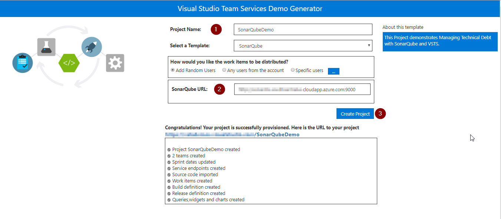
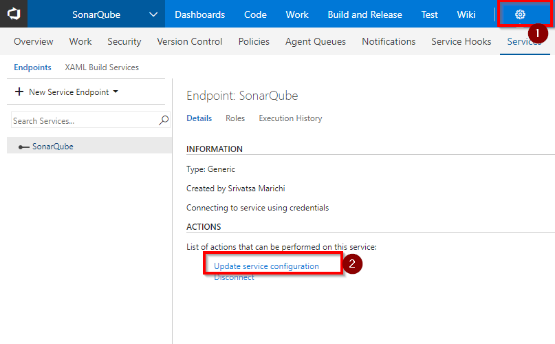
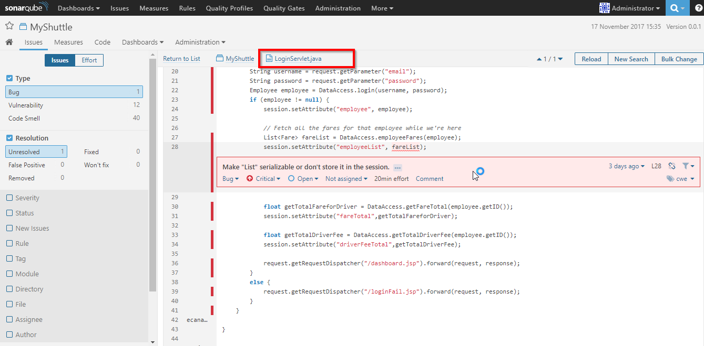

## Managing Technical Debt using VSTS and SonarQube 

## Overview

In this lab, you will be introduced to Technical debt management, how to configure your Team Build Definitions to use SonarQube and how to understand the analysis results.

Technical debt is the set of problems in a development effort that make forward progress on customer value inefficient. Technical debt saps productivity by making code hard to understand, fragile, time-consuming to change, difficult to validate, and creates unplanned work that blocks progress.

<a href="https://www.sonarqube.org/">SonarQube</a> is an open source platform for continuous inspection of code quality to perform automatic reviews with static analysis of code to

- Detect Bugs
- Code Smells
- Security Vulnerabilities
- Centralize Quality</a>

## Pre-requisites

1. **Microsoft Azure Account:** You need a valid and active azure account for the labs

2. You need a **Visual Studio Team Services Account** and <a href="https://docs.microsoft.com/en-us/vsts/accounts/use-personal-access-tokens-to-authenticate">Personal Access Token</a>

## Setting up the Environment

1. Click **Deploy To Azure** to provision SonarQube Server on Azure VM.

   

   Provide the following parameters as shown.

   <table width="100%">
   <thead>
      <tr>
         <th width="50%"><b>Parameter Name</b></th>
         <th><b>Description</b></th>
         
      </tr>
   </thead>
   <tr>
      <td>SQ_VM_Name</td>
      <td>name of the VM where SonarQube will be installed</td>
      
   </tr>
   <tr>
      <td>SQ_DNS_NAME</td>
      <td><b>unique</b> dns name to be provided with the following pattern:- <b>^[a-z][a-z0-9-]{1,61}[a-z0-9]$</b> or it will throw an error. For ex: sonarqubedns</td>
      
   </tr>
   <tr>
      <td>SQ_VM_UserName</td>
      <td>local admin account for the SonarQube VM</td>
      
   </tr>
   <tr>
      <td>SQ_VM_UserPassword</td>
      <td>password for the SonarQube VM</td>
      
   </tr>
   <tr>
      <td>SQ_DBAdmin_UserName</td>
      <td>admin account for Azure SQL Server</td>
      
   </tr>
   <tr>
      <td>SQ_DBAdmin_Password</td>
      <td>password for Azure SQL Server</td>
      
   </tr>
   
   </table>

2. Once the deployment is successful, you will see the resources in Azure Portal.

   

3. Access the **SonarQube** portal by browsing the public address. The default port for SonarQube is 9000. Copy the DNS name from the VM in Azure Portal as shown and append :9000 at the end. The final URL will be **http://YOUR_DNS_NAME:9000**

   

4. Login to the SonarQube Portal using the following credentials-    
   >**Username= admin, Password= admin**

   

## Setting up the VSTS project

1. Use <a href="http://bit.ly/2AWznna" target="_blank">VSTS Demo Data Generator</a> to provision a project on your VSTS account.

   

2. Once the project is provisioned, select the URL to navigate.

   

## Exercise 1: Create a SonarQube Project

In this exercise you will create a Sonarqube project.

1. Login to the SonarQube portal.

2. Click on **Administration** in the toolbar, go to **Projects** tab and click **Management**.

   

3. Create a project with **Name** and **Key** as **MyShuttle**. 

   - **Name**: Name of the project that will be displayed on the web interface

   - **Branch**: Track the quality of short-lived and long-lived code branches

   - **Key**: The project key that is unique for each project

   

## Exercise 2: Update Endpoint

During the project provisioning, a dummy endpoint would be created. We will update the endpoint with sonarqube details.

1. In VSTS, go to **Services** by clicking the gear icon, and click **Update service configuration** link .

   

2. Update endpoint with the below details and click **OK**-

   - **Server URL**: http://YOUR_DNS_NAME:9000
   - **User name**: admin
   - **Password**:  admin

   

## Exercise 3: Modify the Build to Integrate with SonarQube

Now that SonarQube server is running, we will modify the build definition to integrate with SonarQube to analyse the java code provisioned by the demo generator system.

1. Go to **Builds** under **Build and Release** tab, edit the build definition **SonarQube**. The tasks used in the build definition are listed.

   <table width="100%">
   <thead>
      <tr>
         <th width="50%"><b>Tasks</b></th>
         <th><b>Usage</b></th>
      </tr>
   </thead>
   <tr>
      <td><a href="https://docs.microsoft.com/en-gb/vsts/build-release/tasks/build/maven"><b>Maven</b></a> </td>
      <td>maven task compiles and runs unit tests for the java code</td>
   </tr>
   <tr>
      <td><a href="http://bit.ly/2grMxTQ"><b>Copy Files</b></a>  </td>
      <td>copy files will copy the build artifact to VSTS</td>
   </tr>
   <tr>
      <td><a href="http://bit.ly/2yBgXde"><b>Publish Build Artifacts</b></a>  </td>
      <td> publishes the build artifacts </td>
   </tr>
   </table>

3. Click on the **Maven** task and scroll down to the **Code Analysis** section. Configure the SonarQube settings as follows-

   <table width="100%">
   <thead>
      <tr>
         <th width="40%"><b>Parameter</b></th>
         <th><b>Value</b></th>
         <th><b>Notes</b></th>
      </tr>
   </thead>
   <tr>
      <td><b>SonarQube Project Name</b></td>
      <td>MyShuttle</td>
      <td>The name of the project in SonarQube</td>
   </tr>
   <tr>
      <td><b>SonarQube Project Key</b></td>
      <td>MyShuttle</td>
      <td>The unique key of the project in SonarQube</td>
   </tr>
   </table>
   
    

   

3. Save and queue the build.

   

4. You will see the build summary with **Test Results, Code Coverage** and link to **SonarQube Analysis Report** when completed.  The **Quality Gate** displayed in the report is the best way to enforce a quality policy in your organization.

   

5. Click on the **Detailed SonarQube Report** link in the build summary to open the project in SonarQube.

   

## Exercise 4: Analyse SonarQube Reports

We will analyse the report in SonarQube portal to see if there are critical bugs and fix them in our code. In the below dashboard we have a critical bug. Let us fix this.

1. Go to SonarQube and click **Bugs**.

   

2. Double click to see the details of the bug.

   

3. You will see the error in line number 28 of **LoginServlet.java** file as **Make "List" serializable or don't store it in the session**.

   

4. The error is due to explicitly casting the list object by making serializable. Lets fix the bug.

   Go to below path to edit the file in **VSTS** code tab:-
   
   >src/main/java/com/microsoft/example/servlet/LoginServlet.java

   Make the following changes in the code as shown:

   - Go to line number **3** and add the below code.

      >import java.io.Serializable;

      

   - Go to line number **28** and replace the existing code with below snippet.

      >session.setAttribute("employeeList", (Serializable)fareList);

      

5. Save and commit the changes.

6. Once the CI build is completed, you will see the Quality Gate **failing** in the build summary.

   

7. Go to SonarQube portal. You will see the bug count is **0** and fixed now. 

   

We see the Quality Gate is failing after the code change as there is no unit tests created for the new code that we added to fix the bug.

## Summary

With **Visual Studio Team Services** and **SonarQube** you can easily manage code quality.

## Feedback

