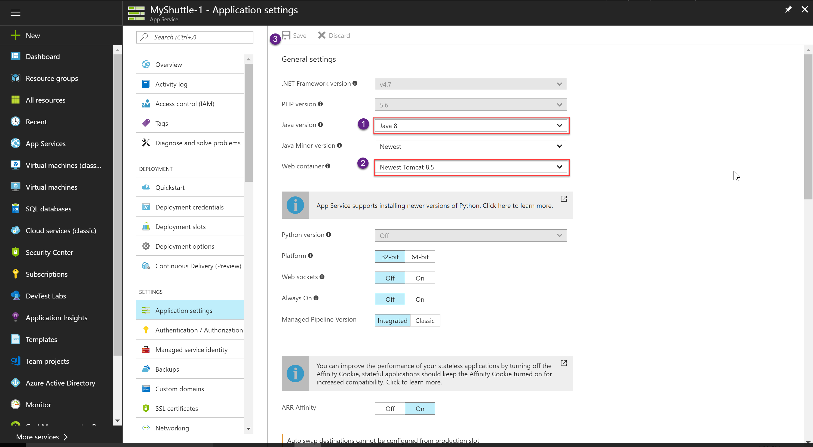

## Deploying to Tomcat and MySQL

In this lab, you will learn how you can use Release Management(RM) in Viusal Studio Team Services (VSTS) to deploy a Java web application to [Apache Tomcat](http://tomcat.apache.org/) with a MySQL database on Azure. Apache Tomcat is an open-source Java Servlet Container developed by the Apache Software Foundation (ASF). MySQL is a popular open-source relational database management system.

For this purpose of the lab, we will use Azure App Service and Azure Database for MySQL, a relational database service based on the open source MySQL Server engine. It is a fully managed database as a service offering capable of handing mission-critical workload with predictable performance and dynamic scalability. 

This lab will show how you can 
 * Create a new Azure App Service and configure it to use Apache Tomcat
 * Create a new MySQL database
 * Use Azure App Service Task to deploy a WAR file

## Pre-requisites
1. Microsoft Azure Account:</b> You will need a valid and active azure account for the labs.

1.  You need a <b>Visual Studio Team Services Account</b> and <a href="https://docs.microsoft.com/en-us/vsts/accounts/use-personal-access-tokens-to-authenticate">Personal Access Token</a>

## Exercise 1: Setting up Visual Studuio Team Services

If you are following this lab from "Working with Jenkins, VSTS and Azure, you may skip this exercise.

1. If you have not already setup, provison a new VSTS project using the <a href="https://vstsdemogenerator.azurewebsites.net" target="_blank">VSTS Demo Data Generator</a> 

1. Use  **MyShuttle** for the template

## Exercise 2: Creating Azure App Service

1. We will use the **Web App + MySQL** image from the Azure Marketplace to deploy a Azure Web App and a MySQL database 

1. 

1. Wait for the Web App to be provisoned. Once it is ready, select the Web app. Click **Application Settings**. Here you can change waht Web container you want the Web App to use. To change it Tomcat, you will first need to install Java. Select a **Java Version** that you want to install and then change **Web container** to use Apache Tomcat. For this purpose of the lab, we will choose ***Java 8*** and ***Apache Tomcat 9.0*** though the version number would not matter much for the simple app that we will be deploying

    

1. 

