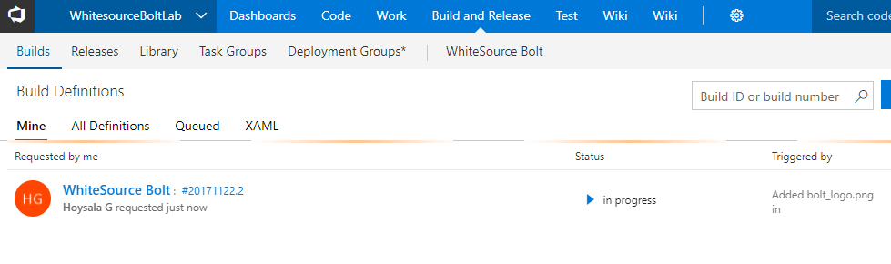

## Checking Vulnerabilities using WhiteSource Bolt with Visual Studio Team Services

## Overview

This lab shows how you can check vulnerabilities in the code using VSTS and WhiteSource Bolt for Java Application.

WhiteSource Bolt is an open source security and management solution. Team Services integration with WhiteSource Bolt will enable you to:

1. Detect vulnerable open source components
2. Get open source inventory reports per project or build
3. Enforce open source license compliance
4. Findout **out-of-date** open source libraries and recommendations to update

## Pre-requisites

1.  You need a <b>Visual Studio Team Services Account</b> and <a href="http://bit.ly/2gBL4r4">Personal Access Token</a>

## Setting up the project

1. Use <a href="https://vstsdemogenerator.azurewebsites.net" target="_blank">VSTS Demo Data Generator</a> to provision a project on your VSTS account 

 2. Select **WhiteSource Bolt** for the template

## Activate WhiteSource Bolt

In your Team project, under **Build and Release** section, go to **White Source Bolt** tab and activate **14 days** trial license.

 

## Exercise

We have a **Java code** provisioned by the demo generator system. We will use **WhiteSource Bolt** extension to check the vulnerable components present in this code.

1. Go to **Build and Release** tab and queue the build.

   

2. You can see the build in progress status. 

   

3. While the build is in progress, let's explore the build definition. The tasks that is used in the build definition are listed in the table below.

    <table width="100%">
   <thead>
      <tr>
         <th width="50%"><b>Tasks</b></th>
         <th><b>Usage</b></th>
      </tr>
   </thead>
   <tr>
      <td><a href="http://bit.ly/2lvftfo"><b>Maven</b></a> </td>
      <td>Used to build your J`ava code </td>
   </tr>
   <tr>
      <td><a href="http://bit.ly/1Vxz1Jb"><b>WhiteSource Bolt</b></a>  </td>
      <td>Detect & fix security vulnerabilities, problematic open source licenses</td>
   </tr>
   <tr>
      <td><a href=""><b>Copy Files</b></a>  </td>
      <td>Used to Copy files from source to destination folder using match patterns </td>
   </tr>
   <tr>
      <td><a href=""><b>Publish Build Artifacts</b></a>  </td>
      <td> Used to share the build artifacts </td>
   </tr>
   </table>

4. Once the build is completed, you can see the summary which shows **test results, code coverage** etc as shown below.

   

5. From your build summary, go to **Whitesource Bolt Build Report** to see the vulnerability report.

   

## Analyse Reports

Now that we have the report generated, lets analyse them one by one.

### Security

This report show the list of all vulnerable open source components with **vulnerability score, vulnerable libraries, description** and **top fix.**

### Outdated Libraries
 
This report shows a comprehensive list of all your Outdated Libraries, including versions and recommendations.

### Inventory

This report shows a comprehensive list of all Open Source libraries including **License Type.**

## Summary

With Visual Studio Team Services, we can implement security to our DevOps pipeline using WhiteSource extensions as part of the build process. This ensures that if there are any vulnerabilities with the code, or the libraries that are being used, it detects and gives a catalogue where you can go and have a fix first and then safely push your code to the desired environments making sure that you are secured enough to go and deliver value to your end users without any security complaints.

## Feedback

